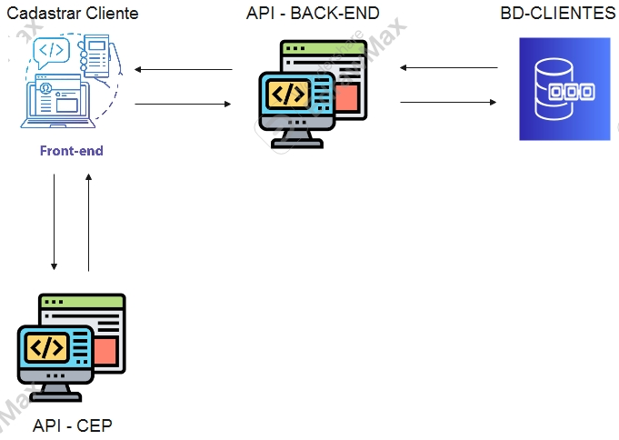

# FRONTEND - MVP - SPRIT - DESENVOLVIMENTO FULL STACK AVANÇADO

Este projeto faz parte do meu sprit final do MVP do curso **Desenvolvimento Full Stack** 

O objetivo aqui é fazer um front-end para cadastro de clientes com intenção de utilizar o endereço informado para entrega de produtos comercializados pela empresa

A ideia é fazer com que os funcionários escalonadas tenham acesso as informações do  clientes atraves do banco de dados.

Atualmente esse processo é feito maualemnte e o escalonamento é feito via whatsapp.

---
## 📊 Fluxograma do Projeto



## Como executar

### Método 1: Execução Local
1. Fazer o download do projeto
2. Verificar se o backend está em execução
3. Abrir o arquivo index.html no seu browser.

### Método 2: Execução com Docker
Para executar o projeto usando Docker, siga os passos abaixo:

1. Certifique-se de ter o Docker e Docker Compose instalados em sua máquina

2. Navegue até a pasta raiz do projeto (onde está o arquivo docker-compose.yml)

3. Execute o seguinte comando para construir e iniciar os containers:
```bash
docker-compose up --build -d
```

4. Acesse a aplicação no navegador através do endereço:
```
http://localhost:8080

```

5. Para parar os containers, execute:
```bash
docker-compose down
```

## 🎯 Objetivo

O frontend tem como objetivo principal:
- Fornecer uma interface amigável para cadastro de clientes
- Facilitar a visualização e gerenciamento das informações
- Permitir o acompanhamento do processo de escalonamento
- Substituir o processo manual de anotação por um sistema digital

## 🚀 Tecnologias Utilizadas

- HTML5
- CSS3
- JavaScript (Vanilla)
- API REST para comunicação com o backend

## 📋 Pré-requisitos

- Navegador web moderno (Chrome, Firefox, Edge, etc.)
- Conexão com a internet (para comunicação com a API)
- Backend em execução (para funcionalidades completas)

## 🔧 Instalação

1. Clone o repositório
2. Navegue até o diretório do projeto
3. Abra o arquivo `index.html` em seu navegador

## 🏃‍♂️ Executando o Projeto

### Modo Desenvolvimento
1. Certifique-se que o backend está em execução
2. Abra o arquivo `index.html` em seu navegador

## 📁 Estrutura do Projeto

```
front/
├── index.html    # Página principal
├── styles.css    # Estilos da aplicação
├── scripts.js    # Lógica da aplicação
└── README.md     # Documentação
└── dockerfile    # contener do front
└── docker-compose     # Criar apenas um contener incluindo o Front e Back   
```

## 🎨 Interface

A interface é composta por:
- Formulário de cadastro de clientes
- Lista de clientes cadastrados
- Sistema de filtros e busca


## 🔄 Integração com Backend

O frontend se comunica com o backend através de endpoints REST:
- POST `/clientes` - Cadastro de novos clientes
- GET `/clientes` - Listagem de clientes
- PUT `/clientes/{id}` - Atualização de clientes
- DELETE `/delete` - Deletar cientes, apos conclução do serviço 


####################################

## 🏠 API de CEP (ViaCEP) - API EXTERNA

Este projeto utiliza a API pública ViaCEP para consulta de endereços.

### Sobre a API
- **Nome:** ViaCEP
- **URL Base:** https://viacep.com.br/ws/
- **Tipo:** API REST/JSON
- **Licença:** Gratuita para uso público
- **Documentação Oficial:** [https://viacep.com.br/](https://viacep.com.br/)

### Endpoint Utilizado
```
GET https://viacep.com.br/ws/{cep}/json/
```

### Exemplo de Resposta
```json
{
  "cep": "01001-000",
  "logradouro": "Praça da Sé",
  "bairro": "Sé",
  "localidade": "São Paulo",
  "uf": "SP",
}
```

### Como é Utilizada
1. O usuário digita o CEP no formulário
2. A aplicação faz uma requisição à API ViaCEP
3. Os campos de endereço são preenchidos automaticamente com a resposta da API
4. O usuário pode editar os campos caso necessário

####################################

## 📝 Licença

Este projeto está sob a licença MIT. Veja o arquivo [LICENSE](LICENSE) para mais detalhes.

## 📫 Contato

Celso F R de Souza - celfraro@gmail.com

Link do Projeto: [https://github.com/seu_usuario/seu_repositorio](https://github.com/seu_usuario/seu_repositorio)

